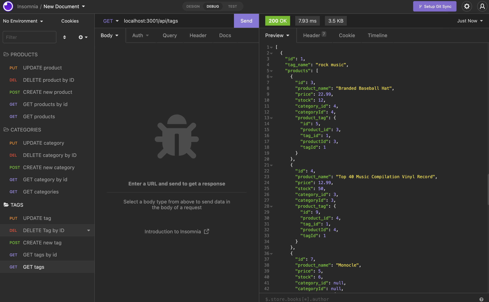
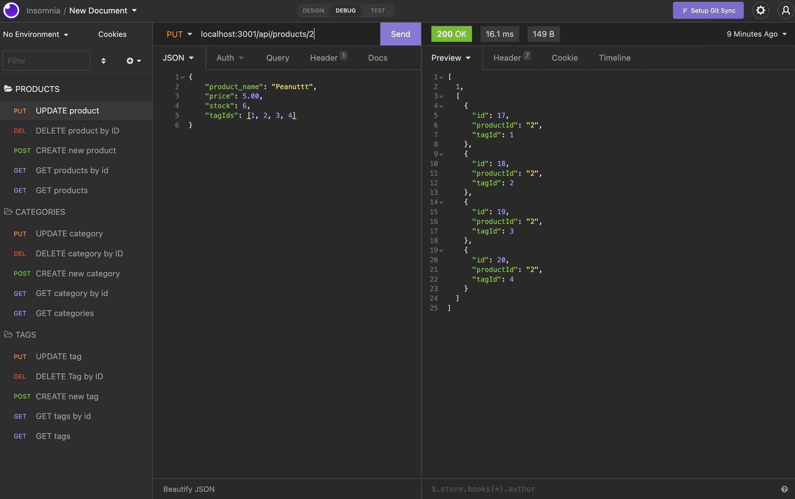

# Ecommerce Everything Pencils
### License:
[](https://opensource.org/licenses/MIT) 
### License Description:
[Click here for the most current description of this license](https://opensource.org/licenses/MIT)

### Video Walkthrough of the project:
[Click here to watch a walkthrough of the video](https://drive.google.com/drive/folders/1aPcGE6_DMf_JfofeDzrjpkjgzBzFul_Q?usp=sharing)

## Table of Contents: 
* [Video Walkthrough](#description)
* [Installation](#installation)
* [Usage Instructions](#usage-instructions)
* [License](#license)
* [Contribution Guidelines](#contribution-guidelines)
* [Tests](#tests)
* [Questions](#questions)
* [Screenshots](#screenshot)


### Description of the project:
The is the backend component to a ecommerce site for an online retail store. It meets MVP criteria. An Express.js API was built to use Sequelize to interact with a MySQL database. This allows the user to be competitive with other retail stores. Currently no front end.

### Installation:
In order to install the necessary dependencies, open the console and run the following:
```npm i, npm start, npm run seed```

### Usage Instructions:
Copy code from SSH keys. Open your terminal and cd to the directory you want to save the code in. Once in the folder, type into the terminal "git clone origin main" followed by the paste of the link, then hit enter.

### Questions:
If you have any questions contact me on [GitHub](https://github.com/AmberZimmerman) 

### Screenshot:
 
 
